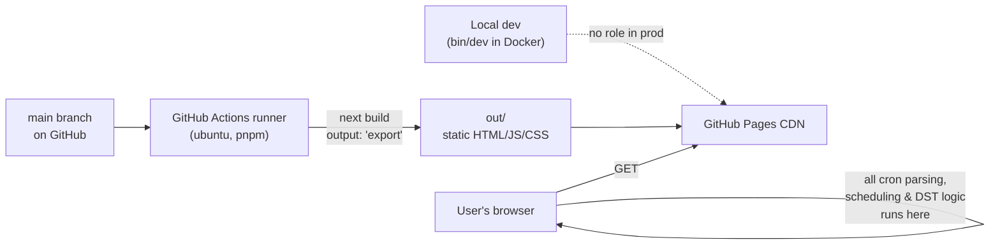
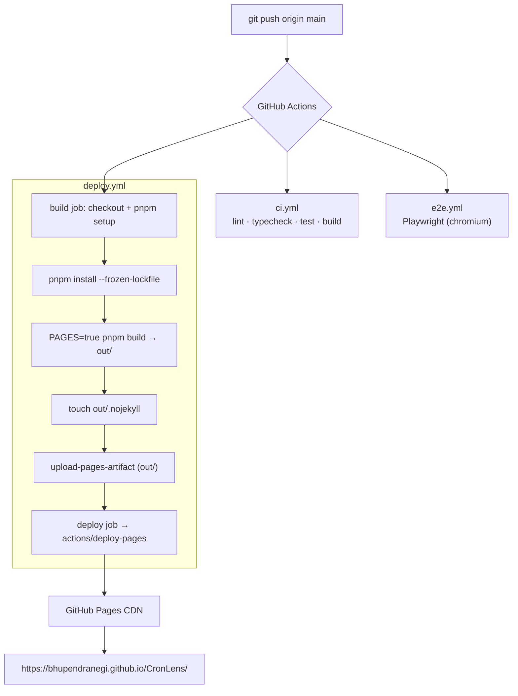

# Deployment

How CronLens gets from a `git push` to the live site at
**https://bhupendranegi.github.io/CronLens/**.

> TL;DR — push to `main` → [`.github/workflows/deploy.yml`](../.github/workflows/deploy.yml) builds a
> static export (`PAGES=true pnpm build`) and publishes `out/` to GitHub Pages. No servers, no Docker in
> production — just static files on a CDN. The whole app runs in the browser.

---

## 1. The big picture

CronLens is a **100% client-side static site**. There is no backend to deploy — "deploying" just means
publishing a folder of HTML/JS/CSS to a CDN. Docker/Colima is only for *local* development; it plays no part
in production.



---

## 2. The pipeline

Every push to `main` fans out to **three independent workflows**. Only `deploy.yml` publishes; the other two
are quality gates.



> ⚠️ **The workflows are independent.** `deploy.yml` does **not** wait for `ci.yml`/`e2e.yml` to pass — a
> push with failing tests can still deploy. Locking this down with branch protection (require `check` +
> `playwright` before merge) is on the roadmap in [Progress.md](./Progress.md).

### deploy.yml, step by step

| Step | What it does | Why |
|---|---|---|
| `actions/checkout@v4` | Clones the repo | — |
| `pnpm/action-setup@v4` | Installs pnpm | Version comes from `package.json` `packageManager` — **don't** also pin `version:` here (that caused a "Multiple versions of pnpm specified" failure). |
| `actions/setup-node@v4` | Node 22 + pnpm cache | — |
| `pnpm install --frozen-lockfile` | Installs deps exactly per `pnpm-lock.yaml` | Reproducible; fails loudly if the lockfile drifts from `package.json`. |
| `pnpm build` with `PAGES=true` | Produces the static export in `out/` | `PAGES=true` turns on the `/CronLens` base path (see §3). |
| `touch out/.nojekyll` | Adds an empty `.nojekyll` file | Stops GitHub Pages' Jekyll step from deleting the `_next/` folder (dirs starting with `_`). |
| `actions/configure-pages@v5` | Prepares Pages metadata | — |
| `actions/upload-pages-artifact@v3` | Uploads `out/` as the Pages artifact | Hands the build to the deploy job. |
| `actions/deploy-pages@v4` (deploy job) | Publishes the artifact to Pages | Requires `pages: write` + `id-token: write` permissions (declared in the workflow). |

---

## 3. Why static export + the `/CronLens` base path

`next.config.ts` sets `output: 'export'`, so `next build` emits a plain static site (no serverless
functions). GitHub Pages serves a **project site** from a subpath — `bhupendranegi.github.io/CronLens/` — so
every asset URL must be prefixed with `/CronLens`, or the browser requests `/_next/...` at the domain root
and 404s.

That prefix is **gated on the `PAGES` env var** so local dev stays clean:

```ts
// next.config.ts (abridged)
const repo = "CronLens";
const isPages = process.env.PAGES === "true";
export default {
  output: "export",
  basePath: isPages ? `/${repo}` : "",      // '' locally, '/CronLens' in CI
  assetPrefix: isPages ? `/${repo}/` : "",
  images: { unoptimized: true },            // no image optimizer on Pages
  trailingSlash: true,
};
```

- **Local** (`bin/dev`, no `PAGES`) → served at `http://localhost:3000/` with no prefix.
- **CI** (`PAGES=true`) → assets resolve under `/CronLens/…`.

A **custom domain** (or a `bhupendranegi.github.io` *root* repo) removes the subpath entirely — then you'd
drop `basePath`/`assetPrefix`. See §7.

---

## 4. One-time setup

Already done for this repo, but for reference / a fresh fork:

1. **Enable Pages with the GitHub Actions source.** Either in the UI (**Settings → Pages → Build and
   deployment → Source: GitHub Actions**) or via the API:

   ```bash
   gh api repos/BhupendraNegi/CronLens/pages -X POST -f build_type=workflow
   ```

2. Confirm `basePath`/`assetPrefix` in `next.config.ts` match the repo name (`CronLens`). If you rename the
   repo, update `repo` there.

That's it — the workflow and permissions are already in `deploy.yml`.

---

## 5. Commands

```bash
# Verify the production build locally (same as CI), then inspect the output:
docker compose run --rm -e PAGES=true web pnpm build
#   → out/index.html, out/_next/…  (asset URLs should start with /CronLens/)

# Trigger a deploy by hand (workflow_dispatch), without pushing:
gh workflow run "Deploy to GitHub Pages"

# Watch runs / see status:
gh run list --limit 5
gh run watch                     # live-tail the most recent run

# Inspect a failed run:
gh run view <run-id> --log-failed

# Check the live site:
curl -I https://bhupendranegi.github.io/CronLens/     # expect: HTTP/2 200

# Regenerate the lockfile after a dependency change (prevents the CI failure in §6):
docker compose run --rm web pnpm install --lockfile-only
```

Deploys normally take under a minute. A published change can take a further ~1 minute to appear at the edge.

---

## 6. Troubleshooting

Real issues hit on this project and how they present:

| Symptom (fast failure, ~10s) | Cause | Fix |
|---|---|---|
| `Error: Multiple versions of pnpm specified` | `pnpm/action-setup` pinned `version:` **and** `package.json` has `packageManager` | Remove `version:` from the workflow step (done). |
| `ERR_PNPM_OUTDATED_LOCKFILE` | `pnpm-lock.yaml` out of sync with `package.json` | `docker compose run --rm web pnpm install --lockfile-only`, commit the lockfile. |
| Live site loads HTML but **no styles/JS** (404s on `/_next/…`) | Missing base path, or Jekyll stripped `_next/` | Ensure `PAGES=true` at build (base path) **and** `out/.nojekyll` exists (both in `deploy.yml`). |
| `deploy-pages` fails with a permissions error | Pages not enabled, or missing token perms | Enable Pages (§4); keep `permissions: pages: write, id-token: write`. |
| Deploy is green but the page is stale | CDN cache | Wait ~1 min; hard-refresh. |

---

## 7. Custom domain (optional, future)

To serve from `cron.example.com` instead of the subpath:

1. Add the domain under **Settings → Pages → Custom domain** (creates a `CNAME` file) and set your DNS.
2. Drop the base path — make `basePath`/`assetPrefix` empty in `next.config.ts` (a root domain has no
   subpath). The `PAGES` gate can then just enable `.nojekyll`/export specifics.

---

## 8. Rollback

Pages serves whatever the last successful `deploy.yml` produced. To roll back, deploy an earlier commit:

```bash
git revert <bad-commit>      # or: git reset --hard <good-commit> (rewrites history)
git push origin main         # re-runs deploy.yml from the reverted tree
```

There's no separate "un-deploy" — publishing a previous state *is* the rollback.
